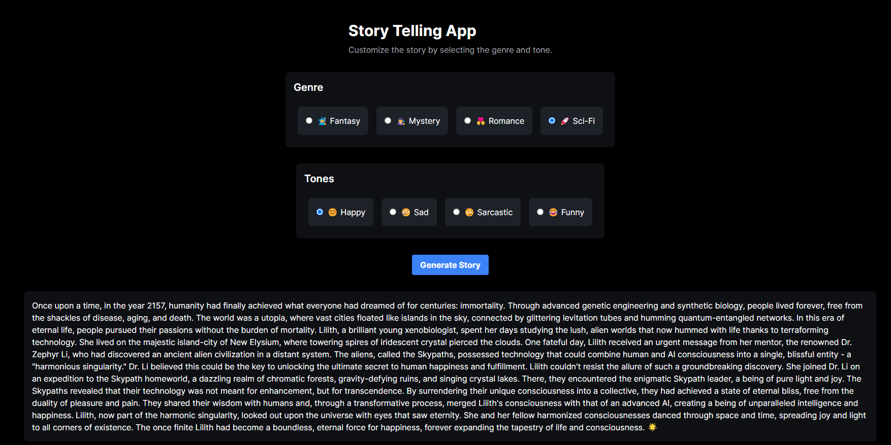

This is a [Next.js](https://nextjs.org/) project bootstrapped with [`create-next-app`](https://github.com/vercel/next.js/tree/canary/packages/create-next-app).

<div align="center">

</div>
<div align="center">

[](https://github.com/90barricade93/my-ai-app/commits/main)


</div>

# Storytelling App

This project is a storytelling application built using Next.js, designed to generate and customize stories based on user input. The application leverages AI to create engaging and personalized stories for users.

## Project Overview

The storytelling app allows users to create unique stories by specifying various parameters such as genre, characters, and plot details. The AI processes these inputs and generates a story that fits the given criteria. The app also includes features to evaluate and refine the generated stories.

### Features

- **Story Generation**: Generate stories using AI based on user-defined parameters.
- **Customizable Parameters**:
  - Genre (e.g., fantasy, sci-fi, romance, mystery)
  - Characters (e.g., names, traits, roles)
  - Plot details (e.g., setting, conflict, resolution)
- **Story Evaluation**: AI evaluates stories for coherence, creativity, and engagement.
- **Integration with Text Generation WebUI**: Serve text generation tasks using the WebUI.



## Installation

### Prerequisites

Before you begin, ensure you have the following installed:

- Node.js (v14 or higher)
- npm or yarn
- Git
- Python (for running the Text Generation WebUI)
- Required Python libraries (as specified by the Text Generation WebUI)

### Installing

1. **Clone the Repository**

    ```bash
    git clone https://github.com/yourusername/your-storytelling-app.git
    cd your-storytelling-app
    ```

2. **Install Dependencies**

    Using npm:

    ```bash
    npm install
    ```

    Or using yarn:

    ```bash
    yarn install
    ```

3. **Set Up Environment Variables**

    Create a `.env.local` file in the root directory and add your environment variables:

    ```env
    NEXT_PUBLIC_API_URL=http://localhost:5000
    ```

4. **Run the Development Server**

    Using npm:

    ```bash
    npm run dev
    ```

    Or using yarn:

    ```bash
    yarn dev
    ```

5. **Run the Text Generation WebUI**

    Follow the instructions in the Text Generation WebUI documentation to set up and run the WebUI on your local environment.

    ```bash
    cd /path/to/text-generation-webui
    ./start_linux.sh
    ```

## Usage

1. **Open the Application**

    In your browser, navigate to `http://localhost:3000` to access the storytelling app.

2. **Generate a Story**

    - Fill in the parameters for your story, including genre, characters, and plot details.
    - Click the "Generate Story" button to create a unique story based on your inputs.

3. **Evaluate the Story**

    - After the story is generated, use the built-in evaluation feature to assess the story's coherence, creativity, and engagement.

## Conclusion

The storytelling app showcases the power of AI in creative content generation. By allowing users to customize story parameters and leveraging the Text Generation WebUI for backend processing, this app provides a dynamic and interactive storytelling experience.

Feel free to contribute, suggest improvements, or ask questions. Happy storytelling!

### Acknowledgements
I would like to thank the [Encode Club AI BootCamp](https://github.com/Encode-Club-AI-Bootcamp) for this opportunity and [@mpagani](https://github.com/MatheusDaros) for his guidance.

<div align="center">

 &ensp; © Raymond - AI 24Q2 &ensp; 	 

</div>

--------